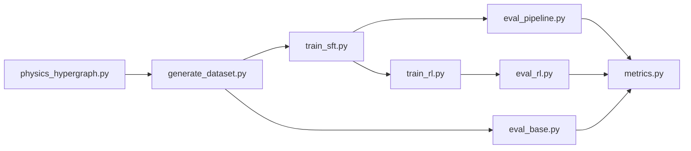

# RL4Education

Physics question generation experiments: build a formula hypergraph, synthesize a supervised dataset with LLM judges, fine-tune Llama-3-8B with LoRA (SFT), optionally refine with RL (GRPO-style), then evaluate and plot metrics.

All experiment commands below are run from the `experiments/` directory:

```bash
cd experiments
```

## Setup

### Requirements

- **Python 3.10** (3.10.x recommended; tested with 3.10.18)
- **CUDA GPU** for SFT and RL training (`train_sft.py`, `train_rl.py`, eval generation)
- **Conda** (Miniconda/Anaconda) or **venv** + pip
- An **Anthropic** and/or **OpenAI** API key for dataset generation, judges, and RL rewards

### 1. Clone and enter the repo

```bash
git clone <repo-url> RL4Education
cd RL4Education
```

### 2. Create a Python environment

**Option A — Conda (recommended)**

```bash
conda create -n question_generation python=3.10 -y
conda activate question_generation
```

**Option B — venv**

```bash
python3.10 -m venv .venv
source .venv/bin/activate   # Linux/macOS
# .venv\Scripts\activate    # Windows
python -m pip install --upgrade pip
```

### 3. Install dependencies

**Full install** (reproduces the project’s pinned environment from `requirements.txt`):

```bash
pip install -r requirements.txt
```

**CUDA PyTorch** — if `pip install -r requirements.txt` fails on torch/CUDA, install PyTorch first for your CUDA version, then install the rest:

```bash
# example: CUDA 12.x — see https://pytorch.org/get-started/locally/
pip install torch torchvision torchaudio --index-url https://download.pytorch.org/whl/cu124
pip install -r requirements.txt
```

**Minimal install** (experiments pipeline only; smaller footprint):

```bash
pip install torch transformers peft datasets accelerate numpy matplotlib \
  anthropic openai python-dotenv
pip install streamlit networkx wandb   # optional: UIs and W&B logging
```

For the older **Hypergraph/** / **Procedural_knowledge/** PPO code, also install:

```bash
pip install trl bitsandbytes rewardanything
```

### 4. API keys

Create `experiments/.env` (gitignored) with at least one provider:

```bash
ANTHROPIC_API_KEY=your_key_here
OPENAI_API_KEY=your_key_here
# optional model overrides
OPENAI_MODEL=o3-mini
CLAUDE_MODEL=claude-sonnet-4-20250514
```

Judges and dataset generation use `--llm-provider claude` (default) or `--llm-provider openai`. Keys can also be passed via `--anthropic-api-key` / `--openai-api-key`.

### 5. Verify the install

```bash
cd experiments
python -c "import torch; print('torch', torch.__version__, 'cuda', torch.cuda.is_available())"
python -c "import transformers, peft, anthropic, openai; print('imports ok')"
```

You should see `cuda True` if a GPU is available.

### 6. Storage paths

SFT and RL adapters default to `/mnt/storage/ae21b026/` (override with `--output_dir`, `--sft_dir`). RL training uses `--cuda-device 0` by default.

### Regenerating `requirements.txt`

From an activated environment with all packages installed:

```bash
pip freeze > requirements.txt
```

For a minimal file from imports only:

```bash
pip install pipreqs
pipreqs experiments --force --savepath requirements.txt
```

---

## End-to-end flow



| Step | Script | Purpose |
|------|--------|---------|
| 0 (optional) | `physics_hypergraph.py` | Rebuild `data/physics_hypergraph.json` |
| 1 | `generate_dataset.py` | LLM-generated SFT training JSON |
| 2 | `train_sft.py` | LoRA supervised fine-tuning |
| 3a | `eval_base.py` | Baseline eval (untuned Llama) |
| 3b | `eval_pipeline.py` | SFT model eval |
| 4 | `metrics.py` | Aggregate stats + PNG plots |
| 5 | `train_rl.py` | RL fine-tune on top of SFT LoRA |
| 6 | `eval_rl.py` | RL adapter eval (same pipeline as 3b) |
| 7 | `metrics.py` | Metrics/plots on RL eval JSON |

**CoT consistency:** Dataset generation uses chain-of-thought by default (`<reasoning>...</reasoning>` then question). If you use CoT data, pass `--with-cot` to `train_sft.py`, `eval_pipeline.py`, `eval_base.py`, `train_rl.py`, and `eval_rl.py`. Use `--no-cot` in `generate_dataset.py` for JSON-only generation.

---

## 0. Hypergraph (optional)

The default graph is already at `experiments/data/physics_hypergraph.json`. Rebuild it with:

```bash
python physics_hypergraph.py
```

Inspect traces interactively:

```bash
streamlit run visualize_traces.py
```

Plot trace-length distribution (exploratory):

```bash
python plot_trace_lengths.py \
  --output data/plots/trace_lengths.png
```

---

## 1. Dataset generation

Generate `(trace, question, difficulty)` rows with feasibility/faithfulness filtering:

```bash
# default: CoT on, difficulties 2/5/8, 80 targets
python generate_dataset.py \
  --output data/dataset.json \
  --num_targets 80 \
  --difficulties 2 5 8 \
  --llm-provider claude

# CoT dataset (used by data/cot/ runs)
python generate_dataset.py \
  --output data/dataset_cot_claude.json \
  --num_targets 80 \
  --difficulties 1 2 3 4 5 6 7 8 9 10 \
  --llm-provider claude

# legacy JSON-only output
python generate_dataset.py --no-cot --output data/dataset.json
```

Useful flags: `--graph`, `--seed`, `--max_depth`, `--min_feasibility`, `--min_coverage`, `--gen-max-tokens`, `--failed-output`. Failed rows go to `<output_stem>_failed.json`.

---

## 2. SFT (supervised fine-tuning)

Train a LoRA adapter on the dataset (default base model: `meta-llama/Meta-Llama-3-8B-Instruct`):

```bash
python train_sft.py \
  --dataset data/dataset.json \
  --output_dir /mnt/storage/ae21b026/sft_lora \
  --epochs 3 \
  --batch_size 4 \
  --grad_accum 16 \
  --lr 1e-4

# CoT SFT (match CoT dataset + --with-cot at eval)
python train_sft.py \
  --dataset data/dataset_cot_claude.json \
  --output_dir /mnt/storage/ae21b026/sft_cot_lora \
  --with-cot \
  --max_len 4096
```

---

## 3. Evaluation

Both eval scripts sample held-out targets from the hypergraph (excluding training targets from `--exclude_targets_from`), generate questions, and call LLM judges for difficulty, faithfulness, and feasibility.

### Base model (no SFT)

```bash
python eval_base.py \
  --output data/claude_faithfulness/eval_base.json \
  --num_targets 40 \
  --difficulties 1 2 3 4 5 6 7 8 9 10 \
  --exclude_targets_from data/dataset.json \
  --llm-provider claude
```

### SFT model

```bash
python eval_pipeline.py \
  --sft_dir /mnt/storage/ae21b026/sft_lora \
  --output data/claude_faithfulness/eval_sft.json \
  --num_targets 40 \
  --difficulties 1 2 3 4 5 6 7 8 9 10 \
  --exclude_targets_from data/dataset.json \
  --llm-provider claude

# CoT eval (must match train_sft.py --with-cot)
python eval_pipeline.py \
  --with-cot \
  --sft_dir /mnt/storage/ae21b026/sft_cot_lora \
  --output data/cot/eval_sft.json
```

Quick qualitative samples (no judges unless `--with-judges`):

```bash
python sample_questions_rl.py \
  --sft_dir /mnt/storage/ae21b026/sft_lora \
  --num-targets 5 \
  --difficulties 2 5 8 \
  --output data/sample_questions.json
```

Browse dataset and eval JSON in a UI:

```bash
streamlit run browse_questions.py
```

---

## 4. Metrics and plots

`metrics.py` reads an eval JSON (from `eval_base.py`, `eval_pipeline.py`, or `eval_rl.py`) and writes a summary JSON plus PNGs.

```bash
# SFT eval
python metrics.py \
  --results data/claude_faithfulness/eval_sft.json \
  --output data/claude_faithfulness/metrics_sft.json \
  --plot_dir data/claude_faithfulness/plots

# Base eval
python metrics.py \
  --results data/claude_faithfulness/eval_base.json \
  --output data/claude_faithfulness/metrics_base.json \
  --plot_dir data/claude_faithfulness/plots_base
```

**Plots written to `--plot_dir`:**

- `difficulty_alignment.png` — requested vs judged difficulty by level
- `alignment_summary.png` — MAE, Pearson r, monotonicity
- `confusion_10x10.png`, `confusion_3x3.png`
- `faithfulness.png`, `feasibility.png`
- `distractors_by_difficulty.png`, `distractor_distribution.png`
- `chapter_coverage.png`, `question_length.png`

---

## 5. RL training

RL starts from the SFT LoRA, samples multiple completions per prompt, and optimizes with a judge-based reward (GRPO-style advantages).

```bash
# faithfulness reward (default)
python train_rl.py \
  --dataset data/dataset.json \
  --sft_dir /mnt/storage/ae21b026/sft_lora \
  --output_dir /mnt/storage/ae21b026/rl_faithfulness_lora \
  --reward faithfulness \
  --epochs 1 \
  --llm-provider claude \
  --cuda-device 0

# other reward modes: feasibility | combined | alternating | adaptive
python train_rl.py \
  --reward adaptive \
  --llm-provider openai \
  --sft_dir /mnt/storage/ae21b026/sft_lora \
  --output_dir /mnt/storage/ae21b026/rl_adaptive_openai

# KL-regularized RL (log per-run logs under data/rl/<name>/)
python train_rl.py \
  --reward combined \
  --kl-beta 0.1 \
  --rl-log-dir data/rl/combined_kl \
  --rl-log-jsonl data/rl/combined_kl/rl_training.jsonl \
  --output_dir /mnt/storage/ae21b026/rl_combined_kl_lora

# CoT RL
python train_rl.py \
  --with-cot \
  --reward faithfulness \
  --sft_dir /mnt/storage/ae21b026/sft_cot_lora \
  --output_dir /mnt/storage/ae21b026/rl_cot_lora
```

**RL logging (automatic):**

- `rl_training.jsonl` — per-step rewards/loss (default under `--rl-log-dir`, usually `data/rl/`)
- `rl_reward_loss.png` — training curve (or set `--rl-plot-png`)
- Checkpoints: `checkpoint-<step>` under `--output_dir` (every third of total steps by default)
- Optional: `--wandb --wandb_project <name>`

---

## 6. RL evaluation and metrics

`eval_rl.py` is a thin wrapper around `eval_pipeline.py` with a default RL adapter path.

```bash
python eval_rl.py \
  --output data/rl/feasibility/eval_rl.json \
  --num_targets 40 \
  --difficulties 1 2 3 4 5 6 7 8 9 10 \
  --llm-provider claude

# specific checkpoint or OpenAI judges
python eval_rl.py \
  --sft_dir /mnt/storage/ae21b026/rl_adaptive_openai/checkpoint-100 \
  --llm-provider openai \
  --output data/rl/eval_ckpt.json

python metrics.py \
  --results data/rl/combined_best/eval_rl.json \
  --output data/rl/combined_best/metrics_rl.json \
  --plot_dir data/rl/combined_best/plots
```

---

## Example full experiment (faithfulness SFT + RL)

Organize outputs under a named folder (pattern used in `data/claude_faithfulness/` and `data/rl/`):

```bash
cd experiments
RUN=data/claude_faithfulness
RL_RUN=data/rl/feasibility

# 1. Dataset
python generate_dataset.py --output data/dataset.json --num_targets 80

# 2. SFT
python train_sft.py --dataset data/dataset.json \
  --output_dir /mnt/storage/ae21b026/sft_lora

# 3. Eval base + SFT
python eval_base.py --output $RUN/eval_base.json --exclude_targets_from data/dataset.json
python eval_pipeline.py --output $RUN/eval_sft.json --exclude_targets_from data/dataset.json

# 4. Metrics + plots
python metrics.py --results $RUN/eval_base.json --output $RUN/metrics_base.json --plot_dir $RUN/plots_base
python metrics.py --results $RUN/eval_sft.json --output $RUN/metrics_sft.json --plot_dir $RUN/plots

# 5. RL
python train_rl.py \
  --reward feasibility \
  --sft_dir /mnt/storage/ae21b026/sft_lora \
  --output_dir /mnt/storage/ae21b026/rl_feasibility_lora \
  --rl-log-dir $RL_RUN

# 6. RL eval + metrics
python eval_rl.py \
  --sft_dir /mnt/storage/ae21b026/rl_feasibility_lora \
  --output $RL_RUN/eval_rl.json
python metrics.py \
  --results $RL_RUN/eval_rl.json \
  --output $RL_RUN/metrics_rl.json \
  --plot_dir $RL_RUN/plots
```

---

## Other directories

| Path | Description |
|------|-------------|
| `experiments/` | Main SFT / RL / eval / metrics pipeline (documented above) |
| `Hypergraph/` | Earlier hypergraph-based PPO RL trainer (`main.py`, `instruction_tune.py`) |
| `Procedural_knowledge/` | Earlier procedural-knowledge PPO pipeline (`main.py`) |

---

## Common CLI flags (all eval / generation scripts)

| Flag | Used in |
|------|---------|
| `--llm-provider {claude,openai}` | `generate_dataset.py`, `eval_*.py`, `train_rl.py` |
| `--llm-model <id>` | override default judge/generator model |
| `--with-cot` | `train_sft.py`, `eval_*.py`, `train_rl.py`, `sample_questions_rl.py` |
| `--num_targets`, `--difficulties`, `--seed`, `--max_depth` | dataset gen + eval |
| `--exclude_targets_from` | eval scripts (held-out targets) |
| `--single_domain` / `--no_single_domain` | match dataset traversal constraints |
